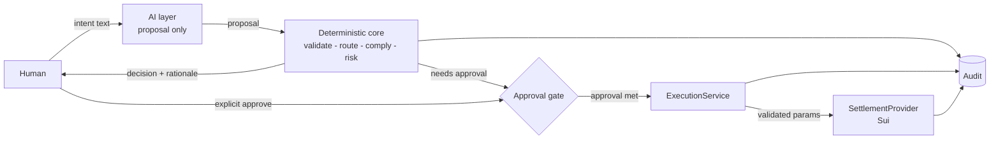

# MOVA — Architecture Overview

> **Phase 0 deliverable.** This is the master blueprint for **MOVA**, an
> AI-native autonomous payment agent. It defines the architecture, the module
> boundaries, and the non-negotiable safety rules that every later phase must
> respect. See [`docs/README.md`](README.md) for the full document set.

---

## 1. What MOVA is

MOVA turns a human payment intent (typed or scanned from a local EMVCo QR) into an
audited, approved, executed settlement on **Sui (Mainnet target)**, with optional
hedging via **Thetanuts V4 / Optionbook** and deterministic compliance/risk
controls at every step.

The canonical flow:

```
QR Scan (local EMVCo decode) ─┐
                              ├─► User Intent
Chat / API text ──────────────┘
  → AI Parsing           (Gemini: suggestion only)
  → Route Discovery      (deterministic)
  → Route Optimization   (deterministic)
  → Compliance           (deterministic engine: ALLOW / REVIEW / BLOCK)
  → Risk / Hedging       (deterministic engine + Thetanuts V4 / Optionbook quotes)
  → Human Approval       (explicit, gated)
  → Execution            (explicit validated params only)
  → Sui Settlement       (MAINNET target — or clearly-simulated mock in dev)
  → Status / Audit       (append-only trail, end-to-end correlation)
```

## 2. Non-negotiable safety principles

These are **rules**, not guidelines. Violating one is a compliance incident.

1. **The AI is never the final authority.** The LLM may parse, recommend,
   explain, and assist. It may NEVER: decide `ALLOW/REVIEW/BLOCK`, produce the
   final risk score, build the final execution payload, or directly call an
   execution/settlement path. It emits *proposals*; deterministic code validates
   and enforces. *(Skills: `ai-deterministic-boundary`, `agentic-workflow-design`.)*
2. **Deterministic engines decide.** Every money figure, route choice, risk
   score, and policy outcome is recomputed by deterministic code. LLM values are
   treated as untrusted input and validated like any external API.
3. **Compliance is a hard gate, and it fails closed.** There is exactly one
   execution path and it passes through the compliance gate. On any engine
   error or unavailable data source the decision defaults to `REVIEW`/`BLOCK`,
   never `ALLOW`. *(Skills: `compliance-gate`, `policy-engine`.)*
4. **Humans approve irreversible value movement.** A payment cannot reach
   `EXECUTING` without an explicit, threshold-met human approval
   (`AWAITING_APPROVAL → APPROVED`).
5. **Every decision is audited, append-only.** One `correlationId` threads
   intent → parse → route → compliance → risk → approval → execution →
   settlement. Corrections are new events, never edits. *(Skill: `audit-trail`.)*
6. **Mocks are honest.** Sponsor mocks are deterministic, marked `simulated`,
   and never fabricate real chain digests or real positions. In `mainnet` mocks
   are structurally refused (fail closed at boot).
7. **QR amounts/accounts are trusted deterministic input.** A local EMVCo
   decode (no external QR API) produces the amount and merchant account; the
   AI may assist interpretation but never overwrites those values. A bad
   CRC-16 rejects the payload (fail-closed).

## 3. High-level architecture

```mermaid
flowchart LR
    subgraph UI["Presentation (apps/web — Next.js)"]
        W[Chat / intent composer]
        S[QR scanner — local EMVCo decode]
        D[Dashboard & timeline]
        A[Approval UI]
        AU[Audit viewer]
    end

    subgraph API["Backend — Supabase (Edge Functions)"]
        R[Edge Function routes]
        ORCH[PaymentOrchestrator]
        WK[Background workers<br/>route / compliance / risk / settlement watcher]
    end

    subgraph CORE["Deterministic core (packages/core)"]
        QR[QrDecoder — packages/qr]
        VAL[IntentValidator]
        RD[RouteDiscovery]
        RO[RouteOptimizer]
        CE[ComplianceEngine]
        RE[RiskEngine]
        HE[HedgingEngine]
        AS[ApprovalService]
        ES[ExecutionService]
        AUD[AuditService]
        SM[PaymentStateMachine]
    end

    subgraph AI["AI layer (packages/ai — proposals only)"]
        PARSER[IntentParser]
        EXPLAIN[Explanation polisher]
    end

    subgraph INT["Sponsor integrations (packages/integrations)"]
        SETT[SettlementProvider<br/>SimulatedSettlementProvider | Sui]
        HEDGE[HedgingProvider<br/>Mock | Thetanuts]
        MKT[MarketDataProvider<br/>Mock | real]
        SCR[ScreeningProvider<br/>Mock | real]
    end

    subgraph DATA["Data — Supabase PostgreSQL (Phase 1)"]
        DB[(Business DB)]
        AUDITDB[(Append-only audit log)]
        RT[Realtime status]
    end

    W --> R
    S --> R
    D --> R
    A --> R
    AU --> R
    R --> ORCH
    QR --> ORCH
    ORCH --> SM
    ORCH --> VAL
    ORCH --> RD --> RO
    ORCH --> CE
    ORCH --> RE --> HE
    ORCH --> AS
    ORCH --> ES
    PARSER --> ORCH
    EXPLAIN --> AUD
    RD --> MKT
    CE --> SCR
    HE --> HEDGE
    ES --> SETT
    ORCH --> DB
    AUD --> AUDITDB
    DB --> RT
    RT --> D
    ES --> AUD
    CE --> AUD
    RE --> AUD
    AS --> AUD
    SM --> AUD
```

## 4. Repository structure

```
muba/
├── README.md                     # project index
├── package.json                  # npm workspaces (packages/*, apps/*)
├── tsconfig.base.json            # strict shared TS config
├── .env.example                  # env-var spec (single source of truth)
├── docs/                         # THIS blueprint (Phase 0 deliverable)
├── scripts/
│   └── phase0-smoke.ts           # validates the foundation (28 checks)
├── packages/
│   ├── types/                    # domain models, enums, state machine (pure data)
│   ├── config/                   # env schema (Zod) + dev/testnet/mainnet boundaries
│   ├── logger/                   # structured logging + typed errors
│   ├── core/                     # module contracts + deterministic state-machine runner
│   ├── qr/                       # local EMVCo QR decoder (deterministic, no external call)
│   ├── ai/                       # Gemini layer — proposals only (Phase 1+)
│   ├── integrations/             # provider interfaces + deterministic mocks
│   └── db/                       # Supabase schema/migrations (Phase 1)
├── apps/
│   └── web/                      # Next.js UI, Supabase client (Phase 1+)
├── supabase/                     # backend platform: config.toml, Edge Functions, migrations
├── contracts/                    # Sui Move package (Phase 2+)
├── SMART_WALLET.md               # LEGACY: EVM PayMaster reference (not MOVA)
├── COMPLIANCE_LAYER.md           # LEGACY: PayMaster compliance reference
├── SKILL_PACK.md                 # generic reusable skill pack
└── skills/                       # reusable skills (governing design rules)
```

## 5. Layer responsibilities

| Layer | Responsibility | Must NEVER |
| --- | --- | --- |
| **Presentation** (`apps/web`) | Render state, collect intent text + QR scan, show compliance/risk rationale, human approval, audit viewer | Contain business/execution logic; call chains directly; send service-role keys |
| **Backend** (`supabase/`) | Edge Functions (HTTP surface + orchestration + workers), Auth, Realtime, RLS, Postgres | Let the LLM drive execution; bypass the state machine |
| **Deterministic core** (`packages/core`) | Validation, routing, compliance, risk, hedging, approval, execution planning, state transitions, audit | Import AI execution; trust LLM numbers |
| **QR decoding** (`packages/qr`) | Local deterministic EMVCo decode → trusted structured intent | Call external QR APIs; let the LLM interpret amounts/accounts |
| **AI layer** (`packages/ai`) | Parse intent (Gemini) → proposal; polish explanations | Import execution/approval modules; decide; sign |
| **Integrations** (`packages/integrations`) | Sponsor boundaries: settlement (Sui), hedging (Thetanuts V4), market data, screening (+ deterministic mocks) | Fabricate real digests/positions; run when `MOVA_ENV=mainnet` with mocks |
| **Data** (`packages/db`, Phase 1) | Supabase Postgres relational store + append-only audit store + RLS policies | Be mutable for audit; store secrets in plaintext |
| **Config** (`packages/config`) | Validate env, enforce network boundary (fail-closed at boot) | Ship a mainnet misconfiguration silently |
| **Logging** (`packages/logger`) | Structured logs with correlation IDs + redaction; typed errors | Log secrets/PII |

### Module → responsibility → forbidden

| Module (contract in `packages/core/src/interfaces.ts`) | Responsibility | Forbidden |
| --- | --- | --- |
| `IntentParser` (AI/Gemini) | Return a structured `ParsedIntentProposal` | Invent amounts; emit final decisions |
| `QrDecoder` (deterministic, local) | Decode EMVCo QR → trusted `QrDecoded` (amount, account, CRC) | Call external QR APIs; let the LLM overwrite decoded values |
| `IntentValidator` (deterministic) | Recompute money, check enums, set `VALIDATED/INVALID/NEEDS_CLARIFICATION` | Trust LLM claims |
| `RouteDiscovery` + `RouteOptimizer` (deterministic) | Produce ranked candidate routes from market data | Let the LLM pick a route |
| `ComplianceEngine` (deterministic) | Screening + monitoring + unified score + policy → `ALLOW/REVIEW/BLOCK`; fail closed | Let the LLM decide |
| `RiskEngine` + `HedgingEngine` (deterministic) | Financial risk band + hedging plan from provider quotes | Let the LLM assign the class |
| `ApprovalService` | Track approvers, threshold, expiry | Auto-approve value movement |
| `ExecutionService` | Build explicit validated params, simulate, execute via `SettlementProvider` | Accept unvalidated/LLM params |
| `PaymentStateMachine` | Advance state only via legal transitions + guards | Be bypassed by any path |
| `AuditService` | Append-only events with `correlationId` | Edit/delete events |

## 6. Trust boundaries



1. **AI ⇢ core:** AI output is untrusted input. The AI package cannot import
   `ExecutionService` or `SettlementProvider` (physical import boundary).
2. **Core ⇢ chain:** Only `ExecutionService` talks to `SettlementProvider`, and
   only with explicit validated params after approval.
3. **Compliance ⇢ execution:** A `BLOCK` decision or an engine error prevents
   any execution path (fail-closed).
4. **Mocks ⇢ real:** Provider interfaces are the seam; mocks are refused in
   `mainnet`.

## 7. Data flow (end to end)

1. **Create** — user submits text; `PaymentIntent` persisted in `CREATED`.
2. **Parse** — `IntentParser` returns a proposal; `IntentValidator` re-computes
   money → `ParsedIntent`; state → `PARSED` (or `FAILED`).
3. **Route** — `RouteDiscovery` (uses `MarketDataProvider`) + `RouteOptimizer`
   rank candidates; state → `ROUTE_FOUND`.
4. **Compliance** — `ComplianceEngine` screens, monitors, scores, and runs the
   policy engine; state → `COMPLIANCE_CHECKED`. `BLOCK` → `FAILED`.
5. **Risk** — `RiskEngine` scores financial risk + `HedgingEngine` quotes a
   hedge (via `HedgingProvider`); state → `RISK_ASSESSED`. `BLOCK` → `FAILED`.
6. **Approval** — `ApprovalService` creates a request; state →
   `AWAITING_APPROVAL`. Human(s) approve → `APPROVED`; reject/expire → `FAILED`.
7. **Execute** — `ExecutionService.buildPlan` → `simulate` → `execute` via
   `SettlementProvider`; state → `EXECUTING`.
8. **Settle** — confirmation → `SETTLED`; revert/timeout → `FAILED`.
9. **Audit** — every step emits an `AuditEvent` under one `correlationId`.

Every state change goes through `PaymentStateMachine`, and each change is
audited (`previousState` → `newState`).

## 8. Cross-cutting concerns

- **Shared types** (`packages/types`) are the single source of truth; the DB
  schema and API DTOs mirror them.
- **QR** (`packages/qr`) is a local deterministic EMVCo decoder — no external
  QR API; decoded amount/account are trusted inputs (see
  `integration-strategy.md`).
- **Money** is always `{ asset, amount }` with `amount` in smallest units as a
  decimal string — never floats (see `conventions.md`).
- **Config** is validated at boot; the network boundary is enforced
  fail-closed (see `environment.md`).
- **Logging** is structured JSON with `correlationId`, redaction, and typed
  errors (see `conventions.md`).

## 9. Key design decisions (and why)

| Decision | Choice | Why |
| --- | --- | --- |
| Backend | **Supabase** (Edge Functions + Auth + Realtime + Postgres) | Hosted Postgres, auth, realtime status push, and an edge runtime that hosts the deterministic engines. RLS is the enforcement layer. |
| Business DB | **Supabase PostgreSQL** (Phase 1) | Relational; audit log is a separate append-only table; role access via RLS. |
| LLM | **Google Gemini** | Structured-output intent parsing (proposal-only); default `AI_PROVIDER=gemini`. |
| Settlement chain | **Sui — Mainnet target** (Move) | Phase 0 spec. Programmable transaction blocks fit batched payment intents; dev/test use devnet/testnet, production is MAINNET. EVM legacy (`SMART_WALLET.md`) is reference-only. |
| Smart-wallet style | Sui owned objects / Move package (`contracts/`, Phase 2) | Adopt the legacy wallet's *security patterns* (authz, nonce/replay protection, reentrancy guard, safe token handling) in Move. |
| Hedging sponsor | **Thetanuts V4 / Optionbook** behind `HedgingProvider` | On-chain options & structured products for downside protection; replaceable. |
| QR initiation | **Local EMVCo decoder** (`packages/qr`) | Deterministic on-device/server decode; no external QR API; CRC-16 validated; amount/account are trusted inputs. |
| Frontend | Next.js + React + Tailwind + Supabase client | Matches skill-pack layering; thin client. |
| State machine | Explicit transition table + guards (`packages/types` + `packages/core`) | Deterministic, testable, auditable; no hidden transitions. |

## 10. Related documents

- [`data-model.md`](data-model.md) — entities & relationships
- [`state-machine.md`](state-machine.md) — lifecycle + guards
- [`api-contracts.md`](api-contracts.md) — interfaces, HTTP API, events
- [`environment.md`](environment.md) — env spec & boundaries
- [`integration-strategy.md`](integration-strategy.md) — mock → real
- [`conventions.md`](conventions.md) — logging & errors
- [`roadmap.md`](roadmap.md) — phased delivery
