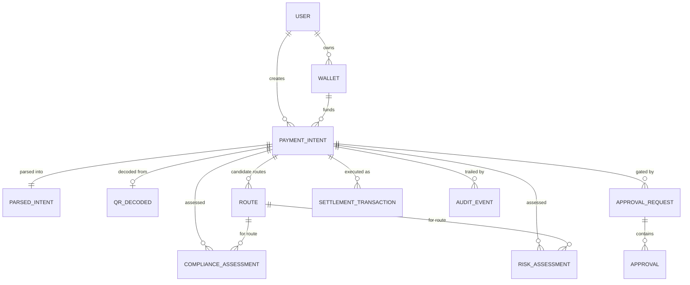

# MOVA — Data Model Design

> **Phase 0 deliverable.** The entities below are defined as TypeScript types in
> `packages/types/src/domain.ts` (single source of truth). The Phase 1 Postgres
> schema (`packages/db`) mirrors them. Money is always a `Money`
> (`{ asset, amount }`, amount in **smallest units as a decimal string**) —
> never floats.

## Entity relationship overview

One payment flow = one `PaymentIntent` + one `correlationId`. Every related
record shares that `correlationId`, giving end-to-end audit traceability.

## Entities

### `User`

| Field | Type | Notes |
| --- | --- | --- |
| `id` | `string` (uuid) | PK |
| `externalId` | `string` | Auth-provider subject id |
| `email` | `string` | |
| `displayName` | `string` | |
| `role` | `UserRole` | `OWNER / APPROVER / OPERATOR / AUDITOR / ADMIN` |
| `status` | `UserStatus` | `PENDING_KYC / ACTIVE / SUSPENDED / CLOSED` |
| `kycStatus` | enum | `NOT_STARTED / PENDING / VERIFIED / REJECTED` |
| `createdAt` / `updatedAt` | `Timestamp` | |

### `Wallet`

| Field | Type | Notes |
| --- | --- | --- |
| `id` | `string` | PK |
| `userId` | `string` | FK → User |
| `type` | `WalletType` | `OPERATING / CUSTODY / RESERVE / VAULT` |
| `network` | `Network` | `SUI_DEVNET / SUI_TESTNET / SUI_MAINNET` |
| `address` | `string` | Sui address (`0x…`) |
| `label` | `string` | |
| `status` | `WalletStatus` | `ACTIVE / FROZEN / CLOSED` |
| `availableBalance` | `Money \| null` | Deterministic ledger snapshot, not a live RPC read |

### `PaymentIntent` (the user's request)

| Field | Type | Notes |
| --- | --- | --- |
| `id` | `string` | PK |
| `correlationId` | `string` | Shared by all records in this flow |
| `intentRef` | `string` | Human ref, e.g. `PAY-2026-0001` |
| `userId` / `walletId` | `string` | FKs |
| `source` | `IntentSource` | `CHAT / API / MANUAL / QR` |
| `rawText` | `string` | **Original request kept verbatim** (auditability) |
| `network` | `Network` | |
| `status` | `PaymentState` | The state machine state (see `state-machine.md`) |
| `createdAt` / `updatedAt` | `Timestamp` | |

> The intent's `status` is the source of truth for the lifecycle. It is written
> ONLY through `PaymentStateMachine` and each change emits an `AuditEvent`.

### `ParsedIntent` (AI output, after validation)

| Field | Type | Notes |
| --- | --- | --- |
| `id` / `paymentIntentId` | `string` | PK / FK |
| `action` | `IntentAction` | `PAY / TRANSFER / BATCH_PAY` |
| `amount` | `Money` | LLM suggestion |
| `recipient` | `{ type, value, name }` | `ADDRESS / HANDLE / EMAIL` |
| `network` | `Network` | |
| `scheduleAt` | `string \| null` | ISO-8601, resolved server-side |
| `memo` | `string \| null` | |
| `confidence` | `number` | 0..1 |
| `needsClarification` / `clarificationQuestion` | `boolean` / `string \| null` | Never guess silently |
| `rawLlmOutput` | `unknown` | Retained for audit |
| `validationStatus` | `ParsedIntentStatus` | `VALIDATED / INVALID / NEEDS_CLARIFICATION` (deterministic) |
| `validatorNotes` | `string[]` | Why invalid / needs clarification |
| `canonicalAmount` | `Money` | **Re-computed by validator** (authoritative) |

> The pre-validation AI shape is `ParsedIntentProposal`. The validator maps a
> proposal → authoritative `ParsedIntent`.

### `QrDecoded` (QR payment initiation — local EMVCo decode)

Produced by `@mova/qr` (`EmvcoQrDecoder`) — deterministic, no network, no LLM.
The decoded amount/account are **trusted inputs**; the AI may assist
interpretation but never overwrites them.

| Field | Type | Notes |
| --- | --- | --- |
| `source` | `"EMVCO"` | |
| `payloadFormat` | `string \| null` | Field 00, e.g. `"01"` |
| `merchantName` / `merchantCity` | `string \| null` | Fields 59 / 60 |
| `merchantAccount` | `string \| null` | Fields 02–05 or 26–51 |
| `categoryCode` | `string \| null` | Field 52 (MCC) |
| `currencyCode` | `string \| null` | Field 53, ISO 4217 numeric (e.g. `458` = MYR) |
| `amountRaw` | `string \| null` | Field 54 decimal, exactly as scanned |
| `amount` | `Money \| null` | Smallest units (2-decimals); asset = currencyCode |
| `countryCode` / `reference` / `billNumber` | `string \| null` | Fields 58 / 62(03) / 62(01) |
| `crcValid` | `boolean` | CRC-16/CCITT over payload minus CRC field |
| `raw` | `string` | Scanned payload, retained for audit |
| `parseErrors` | `string[]` | CRC mismatch, malformed TLV, etc. |

### `Route` (deterministic routing result)

| Field | Type | Notes |
| --- | --- | --- |
| `id` / `paymentIntentId` | `string` | PK / FK |
| `routeNo` | `number` | Candidate number within the intent |
| `legs` | `RouteLeg[]` | Per-leg: from/to/asset/amount/provider/fee/estimatedTimeMs |
| `totalFee`, `totalEstimatedCost` | `Money` | Smallest units |
| `estimatedTimeMs` | `number` | |
| `reliability` | `number` | Deterministic 0..1 |
| `status` | `RouteStatus` | `CANDIDATE / SELECTED / REJECTED` |
| `selectionScore` / `selectionReason` | `number` / `string` | From `RouteOptimizer` |

`RouteCandidate` (from discovery, pre-ranking) is the input to the optimizer.

### `ComplianceAssessment`

| Field | Type | Notes |
| --- | --- | --- |
| `id` / `paymentIntentId` / `routeId` | `string` | PK / FKs |
| `screening` | `ScreeningResult` | `CLEAR / HIT / REVIEW`, matched lists, list version |
| `monitoringSignals` | `MonitoringSignal[]` | Deterministic AML-style rules |
| `riskScore` | `number` | Unified 0..100 compliance score |
| `policyResults` | `PolicyResult[]` | Matched policies + thresholds |
| `travelRule` | `TravelRuleResult` | Completeness + missing fields |
| `decision` | `ComplianceDecision` | **`ALLOW / REVIEW / BLOCK`** (deterministic) |
| `failClosed` | `boolean` | True if any engine error → REVIEW/BLOCK |
| `engineVersion` | `string` | Reproducibility |
| `explanation` | `string` | Deterministic; LLM may polish prose only |
| `createdAt` | `Timestamp` | |

### `RiskAssessment` (financial risk + hedging)

| Field | Type | Notes |
| --- | --- | --- |
| `id` / `paymentIntentId` / `routeId` | `string` | PK / FKs |
| `band` | `RiskBand` | `LOW / MEDIUM / HIGH / CRITICAL` |
| `score` | `number` | 0..100 |
| `signals` | `RiskSignal[]` | Each: `signalId, description, value, threshold, weight, contribution` |
| `hedging` | `HedgingPlan` | `strategy, provider (THETANUTS), params, estimatedCost, expiresAt` |
| `decision` | `RiskDecision` | `PROCEED / REVIEW / BLOCK` |
| `engineVersion` / `explanation` / `createdAt` | | |

### `ApprovalRequest` + `Approval`

| Field | Type | Notes |
| --- | --- | --- |
| `id` / `paymentIntentId` | `string` | PK / FK |
| `level` | `ApprovalLevel` | `SINGLE / DUAL / THRESHOLD` |
| `requiredApproverIds` | `string[]` | |
| `approvals` | `Approval[]` | Each: `approverId, decision, note, signedAt, method` |
| `status` | `ApprovalStatus` | `PENDING / APPROVED / REJECTED / EXPIRED / CANCELLED` |
| `thresholdMet` | `boolean` | Deterministic |
| `reason` | `string` | Human-readable why this needs approval |
| `expiresAt` / `resolvedAt` | `Timestamp \| null` | |

### `SettlementTransaction`

| Field | Type | Notes |
| --- | --- | --- |
| `id` / `paymentIntentId` / `approvalId` | `string` | PK / FKs |
| `type` | `TransactionType` | `NATIVE_TRANSFER / TOKEN_TRANSFER / PTB_BATCH` |
| `network` | `Network` | |
| `payload` | `unknown` | **Explicit, validated execution params — never LLM output** |
| `simulation` | `SimulationResult` | `ok, revertReason?, estimatedGas?` |
| `status` | `TransactionStatus` | `PENDING / SIMULATED / SUBMITTED / CONFIRMED / REVERTED / FAILED / CANCELLED` |
| `txDigest` | `string \| null` | Real Sui digest. **`null` in simulation — never fabricated** |
| `simulated` | `boolean` | Audit marker |
| `error` / `createdAt` / `confirmedAt` | | |

### `AuditEvent` (append-only)

| Field | Type | Notes |
| --- | --- | --- |
| `id` | `string` | PK |
| `correlationId` | `string` | Flow correlation |
| `entityType` / `entityId` | `string` | `PAYMENT_INTENT / ROUTE / COMPLIANCE / RISK / APPROVAL / TRANSACTION` |
| `eventType` | `string` | e.g. `INTENT_PARSED`, `COMPLIANCE_DECIDED`, `APPROVAL_RESOLVED`, `SETTLED` |
| `actor` | `{ type, id }` | `USER / SYSTEM / AI / APPROVER / EXTERNAL` |
| `payload` | `unknown` | Full decision context (inputs, matched rules, outcome) |
| `previousState` / `newState` | `string \| null` | State machine transition |
| `simulated` | `boolean` | Mock-activity marker |
| `timestamp` | `Timestamp` | |

**Immutability:** the audit log is append-only. A correction is a new event,
never an edit. Audit events are **not** operational logs — those go to the
structured logger (see `conventions.md`).

## Money & numeric rules

- All monetary amounts are `Money { asset, amount }` with `amount` a decimal
  string in **smallest units** (e.g. `MIST`/base units on Sui; 6-decimal
  stablecoins use their own base unit).
- Conversions are integer (`BigInt`-safe) math only.
- LLM-provided amounts are suggestions; `IntentValidator` recomputes
  `canonicalAmount` before anything is stored as authoritative.
- `totalEstimatedCost` includes fees + slippage; every component is itemized for
  auditability.

## Persistence plan (Phase 1)

- **Business store:** Supabase PostgreSQL, tables mirroring the entities above.
- **Audit store:** append-only `audit_events` table with indexes on
  `correlationId`, `entityId`, `eventType`, `timestamp`.
- **RLS:** role-based access enforced at the database — `OWNER` full CRUD on
  own data, `APPROVER` read + approval writes, `AUDITOR` read-only audit,
  service role for engine state transitions (see `supabase/migrations/`).
- **Realtime:** status changes pushed via Supabase Realtime
  (`postgres_changes` on `payment_intents.status`).
- **Compliance config:** policies, limits, and watchlist data are versioned
  (see `integration-strategy.md`).
