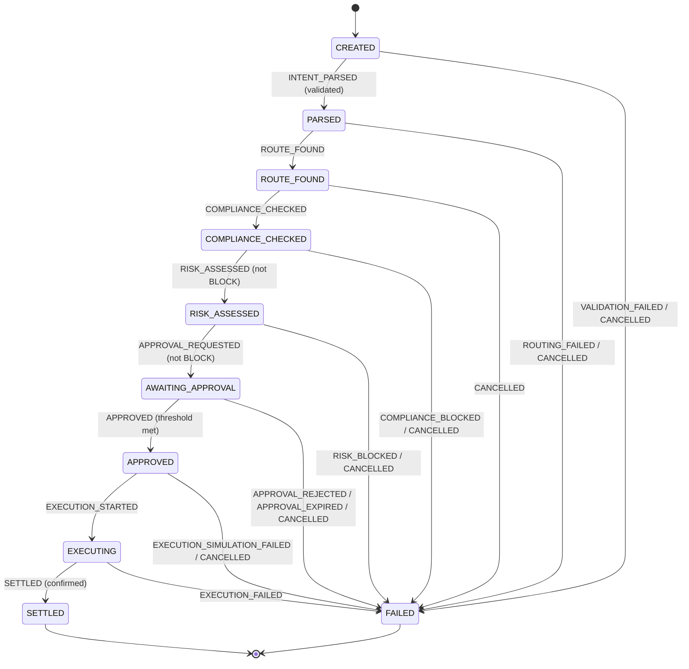

# MOVA — Payment State Machine

> **Phase 0 deliverable.** The canonical lifecycle, encoded as pure data in
> `packages/types/src/payment-state.ts` and executed by the deterministic runner
> in `packages/core/src/state-machine.ts`. The LLM can never move a payment's
> state; only `PaymentStateMachine` (fed by deterministic engines and the
> approval service) can.

## States

```
CREATED → PARSED → ROUTE_FOUND → COMPLIANCE_CHECKED → RISK_ASSESSED
       → AWAITING_APPROVAL → APPROVED → EXECUTING → SETTLED | FAILED
```

| State | Meaning |
| --- | --- |
| `CREATED` | Raw request persisted; nothing processed yet |
| `PARSED` | AI proposal produced **and** deterministically validated |
| `ROUTE_FOUND` | Candidate routes discovered and optimized; a route is selected |
| `COMPLIANCE_CHECKED` | Compliance engine ran (screening, monitoring, score, policy) |
| `RISK_ASSESSED` | Financial risk scored and hedging plan produced |
| `AWAITING_APPROVAL` | Approval request open; waiting on human(s) |
| `APPROVED` | Approval threshold met; execution authorized |
| `EXECUTING` | Simulation passed; submission in flight |
| `SETTLED` | **Terminal** — settlement confirmed |
| `FAILED` | **Terminal** — aborted with a `failureCode` |

## State diagram



## Transition table

Full table in `packages/types/src/payment-state.ts`. Summary of every
transition and its guard:

| From | Event | To | Guard |
| --- | --- | --- | --- |
| `CREATED` | `INTENT_PARSED` | `PARSED` | `intentValidated` |
| `CREATED` | `VALIDATION_FAILED` / `CANCELLED` | `FAILED` | `always` |
| `PARSED` | `ROUTE_FOUND` | `ROUTE_FOUND` | `always` |
| `PARSED` | `ROUTING_FAILED` / `CANCELLED` | `FAILED` | `always` |
| `ROUTE_FOUND` | `COMPLIANCE_CHECKED` | `COMPLIANCE_CHECKED` | `always` |
| `ROUTE_FOUND` | `CANCELLED` | `FAILED` | `always` |
| `COMPLIANCE_CHECKED` | `RISK_ASSESSED` | `RISK_ASSESSED` | `complianceNotBlocked` |
| `COMPLIANCE_CHECKED` | `COMPLIANCE_BLOCKED` / `CANCELLED` | `FAILED` | `always` |
| `RISK_ASSESSED` | `APPROVAL_REQUESTED` | `AWAITING_APPROVAL` | `riskNotBlocked` |
| `RISK_ASSESSED` | `RISK_BLOCKED` / `CANCELLED` | `FAILED` | `always` |
| `AWAITING_APPROVAL` | `APPROVED` | `APPROVED` | `approvalsMet` |
| `AWAITING_APPROVAL` | `APPROVAL_REJECTED` / `APPROVAL_EXPIRED` / `CANCELLED` | `FAILED` | `always` |
| `APPROVED` | `EXECUTION_STARTED` | `EXECUTING` | `always` |
| `APPROVED` | `EXECUTION_SIMULATION_FAILED` / `CANCELLED` | `FAILED` | `always` |
| `EXECUTING` | `SETTLED` | `SETTLED` | `settlementConfirmed` |
| `EXECUTING` | `EXECUTION_FAILED` | `FAILED` | `always` |
| `SETTLED` / `FAILED` | — | — | terminal (no transitions) |

## Guards (deterministic)

`PaymentGuardContext` is built by deterministic code and passed to the machine.

| Guard | Passes when |
| --- | --- |
| `always` | Always |
| `intentValidated` | `ParsedIntent.validationStatus === "VALIDATED"` |
| `complianceNotBlocked` | `ComplianceAssessment.decision !== "BLOCK"` |
| `riskNotBlocked` | `RiskAssessment.decision !== "BLOCK"` |
| `approvalsMet` | `ApprovalRequest.thresholdMet === true` |
| `settlementConfirmed` | Real digest received, **or** simulated-mode confirmation recorded |

Guards are enforced in `PaymentStateMachine.apply(from, event)` — an attempt
that fails a guard returns `ok: false` with the reason and never mutates state.

## Failure codes

Every path to `FAILED` carries a machine-readable `failureCode`:

```
VALIDATION_FAILED | ROUTING_FAILED | COMPLIANCE_BLOCKED | RISK_BLOCKED
| APPROVAL_REJECTED | APPROVAL_EXPIRED | CANCELLED
| EXECUTION_SIMULATION_FAILED | EXECUTION_FAILED | INTERNAL_ERROR
```

The failure code is written to the `AuditEvent` and surfaced in the API so the
UI can render the right remediation.

## Rules

1. **Only `PaymentStateMachine` writes state.** No service calls
   `UPDATE payment_intents SET status = ...` directly.
2. **Every transition is audited.** `AuditEvent` records
   `previousState → newState`, the triggering `event`, and the `actor`.
3. **`FAILED` is reachable from any active state** (via its legal events) and
   is terminal — no retry without a new flow (idempotency is preserved by the
   per-flow `correlationId`).
4. **A `BLOCK` is never ignorable.** It lands in `FAILED` with
   `COMPLIANCE_BLOCKED`/`RISK_BLOCKED`, which disables the approval/execution
   path.
5. **`SETTLED` requires confirmation.** In simulation mode the mock returns a
   `simulated: true` outcome (no digest) and the state machine records the
   transition; the audit event is flagged `simulated`.

## Persistence

The current state is stored on `PaymentIntent.status`. A full event history is
reconstructable from `audit_events` by `correlationId` (append-only).
