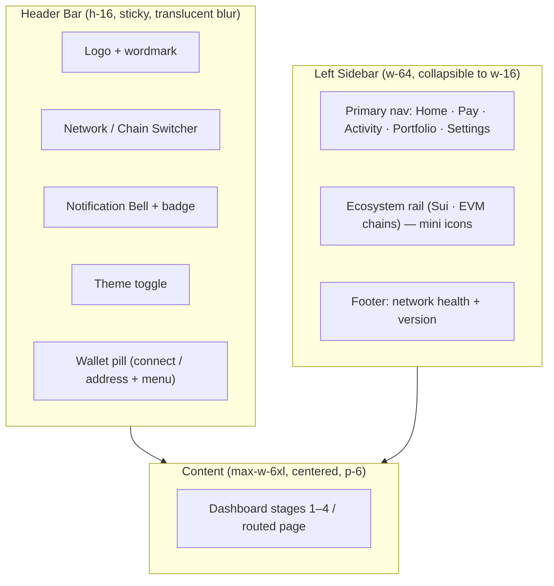
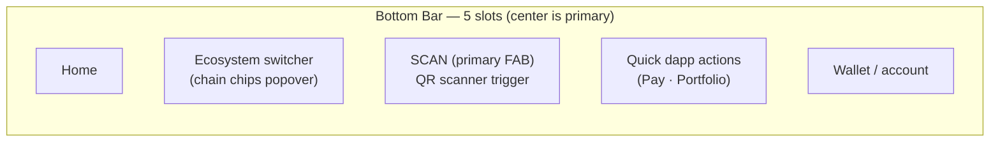
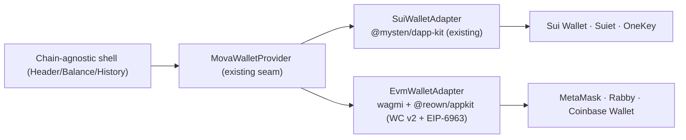

# MOVA — Interface Redesign: 6 Core Features (UI/UX Specification)

**Status:** Proposal / Design-of-record
**Scope:** `apps/web` only — no business-logic changes. The payment pipeline,
wallet safety boundary, and deterministic engines are untouched.
**Design language:** MOVA tokens in `apps/web/app/globals.css` (bark/vellum,
signal/ledger/ember/alarm, chain-*, Fraunces + IBM Plex Sans/Mono). Reuse the
existing primitives in `components/ui.tsx` (`Card`, `Badge`, `Button`, `Code`).
Never hardcode colors; extend the token set when a role is missing.

> This document is the contract of record for the UI refactor. When a later
> phase changes a decision here, update this document AND the components in the
> same change. See [`README.md`](README.md) for the document index.

---

## 0. Guiding principles

1. **Chain-agnostic shell, ecosystem-aware content.** The shell (header,
   sidebar, bottom bar, toasts, balance) must not assume Sui. Each ecosystem
   registers metadata (chain id, explorer, native asset, brand color) and the
   shell renders from it.
2. **Every state is explicit.** Connecting / wrong network / pending / failed /
   simulated / privacy-hidden are first-class states, never an afterthought.
3. **Human-in-control remains the visual grammar.** Approval actions stay
   ledger-green and irreversible; AI-proposed content stays neutral with an
   explicit origin label. No UI change may blur this.
4. **Accessibility first (WCAG 2.1 AA).** Minimum 4.5:1 for body/mono text in
   both themes, visible focus rings, `prefers-reduced-motion` respected, and
   touch targets ≥ 44×44px on the bottom bar.
5. **Desktop = header + rail; mobile = header + bottom bar.** One content tree,
   two chrome shells, shared component library.

---

## 1. Layout Restructuring (Header Bar & Sidebar)

### 1.1 Goals

- Give every primary destination (Home, Send/Pay, Activity, Portfolio/Balance,
  Notifications, Settings) a stable, discoverable home.
- Keep the wallet + network state permanently visible and actionable from one
  place (currently the only chrome is a sticky header).
- Preserve the current single-owner "judge narrative" flow — stages 1→4 — as
  the primary surface, not regress to scattered pages.

### 1.2 Target layout (desktop, ≥1024px)



**Desktop breakpoints:**

| Breakpoint | Layout |
| --- | --- |
| ≥1280px | Header + full sidebar (w-64) + centered content |
| 1024–1279px | Header + icon-only sidebar (w-16, labels on hover) |
| <1024px | Header (condensed) + content; **bottom bar** replaces the sidebar (see §2) |

### 1.3 Header Bar anatomy (left → right)

1. **Brand block** — `BrandMark` + `MOVA` wordmark. Clicking returns to
   `/` (Home). Add `aria-label="MOVA home"`.
2. **Network / Chain Switcher** (see §1.5) — compact pill showing the active
   chain dot (uses `--chain-*`), chain name, and a chevron. Clicking opens a
   popover with ecosystem groups.
3. **Primary Global Actions** — contextual, mounted from a `HeaderActions`
   slot so pages can inject actions (e.g. "Reset demo", "New payment").
4. **Notification Bell** — unread-count badge (cap display at "9+"). Opens the
   Notification Center popover (§5). State persists in `notificationFeed`.
5. **Wallet pill** — replaces the bare `WalletConnectButton`. Connected →
   truncated address + provider icon + ledger-green status dot; click opens an
   account menu (copy address · view on explorer · switch network ·
   disconnect). Disconnected → primary "Connect" button that opens the wallet
   picker (§4).

**Interaction guidelines:**

- The header is `position: sticky; top: 0; z-index: 40` with `bg-translucent
  backdrop-blur` (already the pattern) so content scrolls beneath without
  losing context.
- All header controls are ≥ 36px tall; icons get `aria-hidden` + adjacent
  visually-hidden text labels.
- The wallet pill must never truncate below ~12 chars of the address; use
  `shortAddress(address, 6, 4)` plus a `title` tooltip with the full address.
- Keyboard: `Ctrl/Cmd+K` focuses the primary search/pay input (a future global
  command); `1..5` selects sidebar items; `Esc` closes any popover.

### 1.4 Sidebar

Left rail, `w-64` (expanded) / `w-16` (collapsed), own scroll, `border-r
border-hairline`. Sections, top → bottom:

1. **Primary nav** — icon + label rows. Active item gets `bg-surface-2` +
   signal left-border indicator (not just a text-color change) so state is
   visible in both themes.
   - Home (Dashboard stages)
   - Pay / Send (focuses the chat composer, or routes to a dedicated pay page)
   - Activity (Transaction History, §3)
   - Portfolio (Wallet Balance, §6)
   - Settings
2. **Ecosystem rail** — compact row of chain chips (Sui + EVM chains MOVA
   routes on). Only *available* ecosystems show; disabled/unsupported chains are
   excluded or shown greyed with a lock tooltip.
3. **Footer** — read-only status: current network (e.g. `sui:testnet`), RPC
   health dot, `vX.Y.Z`.

**Interaction guidelines:**

- Collapse/expand is persisted in `localStorage["mova-rail"]`.
- On collapsed rail, hover reveals a flyout tooltip with the label.
- Sidebar is hidden entirely <1024px and its *destinations* are surfaced in the
  bottom bar (§2) — never a hamburger that hides primary actions.
- Nav model is **destinations, not stages** — but Home keeps the numbered
  stage narrative intact so the demo story stays judge-friendly.

### 1.5 Network / Chain Switcher — component contract

```ts
interface ChainOption {
  id: string;                 // "sui:testnet" (CAIP-2) or "eip155:8453"
  ecosystem: "sui" | "evm";
  label: string;              // "Sui Testnet", "Base"
  colorVar: string;           // "var(--chain-sui)"
  explorerUrl: string;
  isAvailable: boolean;       // false → greyed/locked
  current?: boolean;
}
```

- Popover groups by ecosystem with a section header ("Sui", "EVM").
- Selecting a Sui network calls the existing `switchNetwork(DappNetwork)` from
  `mova-wallet-context` (which also flips the demo wallet). Selecting an EVM
  chain delegates to the EVM adapter's `wallet_addEthereumChain` (§4).
- Show a transient "Switching…" state on the pill; never block the UI.
- Persist the user's last choice; restore on load.

---

## 2. Multi-Ecosystem Bottom Bar

Mobile-first persistent navigation, `position: fixed; bottom: 0;
padding-bottom: env(safe-area-inset-bottom); height: 64px + safe-area;
z-index: 50; border-top: 1px solid var(--border); background: var(--bg-translucent);
backdrop-filter: blur(12px)`.



### 2.1 Slots (left → right)

1. **Home** — returns to dashboard. Active state = signal tint.
2. **Ecosystem switcher** — chain-chip stack; tapping opens the same popover as
   §1.5 but full-screen-bottom-sheet style on mobile (`h-1/2` sheet, drag
   handle, rounded top). This is the *primary* ecosystem-switching surface on
   mobile.
3. **Scan (primary FAB)** — center, raised 56×56px circle, signal gradient,
   scanner glyph. Taps mount the existing `QrScanInterface` camera flow (it
   already handles permission/error/unsupported states). Placeholder on large
   screens is a header/global action instead.
4. **Quick dapp actions** — a 2×2 flyout (Pay / Portfolio / History /
   Settings) that mirrors sidebar destinations; keeps actions one thumb-reach
   away.
5. **Wallet / account** — mini wallet pill (status dot + short address or
   "Connect"). Tapping opens the account sheet (copy · explorer · disconnect).

### 2.2 Interaction guidelines

- **Safe areas:** always `padding-bottom: env(safe-area-inset-bottom)`; add a
  `viewport-fit=cover` meta and `theme-color` matching the background to avoid
  white bars on iOS.
- **Thumb ergonomics:** all five slots ≥ 48×48px tappable; the FAB is centered
  and 56px. Fire-and-forget taps, no hover dependence.
- **Sheet transitions:** bottom sheets slide up `var(--ease-out)` 240ms; the
  ecosystem sheet and account sheet use the same motion language.
- **Reduced motion:** sheets become instant fades when
  `prefers-reduced-motion: reduce`.
- **No overlap:** main content gets `pb-24` so nothing hides under the bar.
- Only render one open surface at a time (auto-close the ecosystem sheet when
  the account sheet opens).

### 2.3 Component sketch

```
BottomBar
├── Slot Nav (Home)
├── EcosystemSheetTrigger (chip stack) → EcosystemSheet (uses §1.5 ChainOption[])
├── ScanFab → QrScanInterface (mounts camera)
├── QuickActionsFlyout (Pay · Portfolio · History · Settings)
└── AccountSheetTrigger → AccountSheet (copy · explorer · disconnect)
```

---

## 3. Transaction History (Txn History)

Upgrade the existing `TransactionHistory` card into a **full Activity panel**
(desktop: routed page or right-side tab; mobile: bottom-bar "Activity" sheet).

### 3.1 Information architecture

- **Filters:** All · Pending · Success · Failed · and a category filter
  (Payment · Approval · Hedge · Swap/Conversion · Received). Filter chips use
  `Badge` tones; active filter = `signal`.
- **Grouping:** group by day ("Today", "Yesterday", date headers) with a
  sticky group header.
- **Search:** filter by recipient/`shortId`/digest prefix (client-side, `indexOf`
  on lowercase).

### 3.2 Row anatomy

```
┌────────────────────────────────────────────────────────────┐
│ [category icon] Payment        [Pending ● (spinner)]        │
│  200 USDC → @Merchant                       2.1s ago        │
│  Route #3 SUI→USDC · Gas 0.0012 SUI · Fees 0.4 USDC         │
│  [View on SuiScan ↗]      [receipt #4f9c…]                   │
└────────────────────────────────────────────────────────────┘
```

Per row:

1. **Leading** — category icon in a tinted square (`--ledger-bg` etc.).
2. **Title line** — `formatMoney(amount)` + arrow + `shortAddress`/`@handle`
   recipient.
3. **Meta line** — category · route · **gas fee** (native) · **total fees**
   (quote asset). All numbers render in `font-mono`.
4. **Status badge** — `Pending` (ember + animated pulse dot) / `Success`
   (ledger) / `Failed` (alarm) using the existing `Badge` tones.
5. **Trailing** — relative timestamp (with `title` = absolute
   `formatDateTime`), receipt chip, and an **external explorer link**
   (`https://suiscan.xyz/{network}/tx/{digest}`, `_blank`,
   `rel="noreferrer"`). Simulated rows show `simulated (no value moved)` chip
   instead of a digest link.
6. **Expandable detail** — tap to reveal the full audit trail for that record
   (reuse `AuditTrailPanel` content inline).

### 3.3 Real-time status indicators

- **Pending:** 12px ember dot with a `pulse` keyframe (2s ease-in-out infinite,
  paused under `prefers-reduced-motion`) + `aria-live="polite"`.
- **Success/Failed:** terminal states, static badge; no glow.
- The panel **subscribes to the store** (`records`, `receipts`, `plans`) so a
  state change from `AWAITING_APPROVAL → SETTLED/FAILED` re-renders the row in
  place — no polling needed since the demo pipeline already drives the store.

### 3.4 States

| State | Rendering |
| --- | --- |
| Empty | Illustrated empty state + "Pay" CTA (chat focus) |
| Loading (future RPC) | 3 skeleton rows with `animate-pulse` |
| Error (future RPC) | Alarm-tone inline banner + retry |
| Privacy-hidden | Rows show masked amounts, `•••` (§6.4 applies globally) |

### 3.5 Data contract

Keep using `PaymentRecord`/`PaymentReceipt` from the store. Where a record lacks
gas (simulated), render `gas —`; never fabricate a fee.

---

## 4. WalletConnect Technical Fact-Check (EVM vs. Sui)

### 4.1 The question

> Are direct browser extensions (MetaMask, Sui Wallet) strictly required, or can
> WalletConnect v2 unify the connection experience across EVM and non-EVM (Sui)?

**Short answer:** WalletConnect v2 **cannot** be the single unifying layer today.
It is a first-class standard for EVM; **Sui is not a first-class WalletConnect
namespace** and the major Sui wallets do not implement WalletConnect — they
implement the **Wallet Standard** (`wallet-standard`, consumed by
`@mysten/dapp-kit`). The robust architecture is a **multi-adapter abstraction**
behind one chain-agnostic seam (which MOVA already has: `MovaWalletProvider`).

### 4.2 What each ecosystem requires

**EVM (MetaMask, Rabby, Coinbase Wallet, Trust…):**
- **Desktop injection:** EIP-1193 provider + **EIP-6963** multi-provider
  discovery. This is the 1-click path and is *not* strictly required if you only
  want QR/mobile flows — but it is expected UX and trivially cheap with
  `wagmi`/`viem`.
- **Mobile / cross-device:** WalletConnect v2 — QR pairing, `wc:` deep links,
  session persistence via the WalletConnect relay. Mature SDKs:
  `@reown/appkit`, `@walletconnect/ethereum-provider`, `@walletconnect/web3wallet`.
- **Chain switching:** `wallet_addEthereumChain` / `wallet_switchEthereumChain`.

**Sui (Sui Wallet, Suiet, OneKey, Surf…):**
- **Injection/discovery:** Wallet Standard (`standard:connect`, account events).
  `@mysten/dapp-kit-react` v2 reads this directly — this is what MOVA already
  uses (`useWallets`, `useDAppKit`, `useWalletConnection`).
- **Mobile / cross-device:** wallet-specific deep links / app-link scanning;
  there is **no neutral cross-wallet standard** equivalent to WalletConnect that
  all Sui wallets implement.
- **Signing:** `sui:signTransaction` / `sui:signTransactionBlock` (with
  `sui:signPersonalMessage` for ownership proofs — already implemented).

### 4.3 Comparison table

| Dimension | EVM (MetaMask et al.) | Sui (Sui Wallet, Suiet, OneKey) |
| --- | --- | --- |
| Primary connection protocol | **WalletConnect v2 (first-class)** + EIP-6963/EIP-1193 injection | **Wallet Standard** (via `@mysten/dapp-kit`); WalletConnect **not** first-class |
| Desktop UX | 1-click injection; WC optional | 1-click injection via dapp-kit |
| Mobile/QR UX | WC v2 QR pairing, `wc:` deep links, WalletConnect Cloud relay | Wallet-specific deep links / app-link; no unified neutral QR standard |
| Session persistence | WC v2 relay sessions (multi-day, cross-app) | dapp-kit restores standard-wallet sessions per app; Demo Wallet is in-memory per load |
| Multi-chain scope | One `eip155` namespace covers all EVM chains (cheap chain switching) | `sui:mainnet/testnet/devnet` only — one chain |
| SDK maturity | `@reown/appkit`, `wagmi`, `viem` — very mature | `@mysten/dapp-kit` v2 — mature for Sui (already in use) |
| Signing methods | `eth_sendTransaction`, `personal_sign`, EIP-712 typed data | `sui:signTransaction`(+Block), `sui:signPersonalMessage` |
| Key custody | In-wallet, never leaves wallet | In-wallet, never leaves wallet |
| Effort to "unify with WC v2 alone" | Low (native) | **High → not viable** (no uniform wallet support) |
| Recommended approach | **WC v2 + EIP-6963** | **Wallet Standard / dapp-kit** (keep existing) |

### 4.4 Verdict & recommendation

- **Do not** bet the app on "WalletConnect for everything". WC v2 will not
  connect Sui wallets today; forcing it means building/maintaining a non-standard
  bridge the major Sui wallets won't honor.
- **Do** keep MOVA's `MovaWalletProvider` as the single seam and add adapters:



- **Wallet picker UX:** one "Connect" flow; the picker groups wallets by
  ecosystem ("Sui wallets" / "EVM wallets") with a small chain badge so the
  user picks the right universe. Never show a flat undifferentiated list.
- **Network/chain state** stays resolved per-adapter and normalized into MOVA's
  existing `MovaNetworkState` (matches/wrong-network) so the rest of the app —
  gate, approvals, banners — is untouched.
- **EVM scope (recommend):** start with EVM **read-only / connect + sign**
  surfaces (balance, history, signature proofs) before EVM settlement. EVM
  settlement would require a second compliance/gate path — out of scope for this
  UI refactor.

---

## 5. Interactive Notification System

### 5.1 Toast anatomy with auto-dismiss progress

Replace the current bare `NotificationArea` toasts with a richer, themed toast:

```
┌──────────────────────────────────────────────┐
│ ● Success   Payment completed         [✕]    │
│   200 USDC → @Merchant · tx #4f9c…            │
│ ▓▓▓▓▓▓▓░░░░  (auto-dismiss progress, 6s)     │
└──────────────────────────────────────────────┘
```

- **Placement:** top-right desktop (`right-4 top-4`), **top** on mobile
  (below the header, full-width minus margins) so the bottom bar never overlaps
  toasts.
- **Tones:** map `kind` → existing tokens (info=signal, success=ledger,
  warning=ember, error=alarm) via `--*-bg/--*-border/--*-text`, **not** hardcoded
  sky/emerald/rose Tailwind classes (current `NotificationArea` hardcodes them —
  standardize on tokens so both themes work).
- **Auto-dismiss:** default 6s (success/info), 10s (warning/error), with a
  **progress bar** at the toast bottom animating width 100%→0 over the lifetime
  (`linear`, 1px height, `--*-text` color at 60% opacity). Progress pauses on
  hover/focus; `Esc` or ✕ dismisses immediately.
- **Reduced motion:** progress becomes a static "⏳" indicator, no slide.
- **Stacking:** max 4 toasts (already `slice(-4)`); newer toasts push older ones
  down; each toast is `aria-live="polite"` (`assertive` for errors).
- **Sticky vs. transient:** transient toasts (in `notifications`) auto-dismiss;
  the persistent feed (`notificationFeed`) stays in the Notification Center
  panel (`NotificationsPanel`) — keep these two concepts, they map cleanly.

### 5.2 Toggleable sound effects

- **Events → sounds:** success (short high ding), error (low double-thud),
  approval-required (soft chime), incoming payment (subtle tick). Pending state
  changes play **no** sound (avoid ambient noise).
- **Implementation:** Web Audio API oscillators (no asset files):
  success = 880Hz→1320Hz sine 180ms; error = 220Hz→110Hz triangle 300ms;
  chime = two 660Hz notes. Generated lazily on first user gesture (autoplay
  policies), stored in a module-level `AudioContext` singleton.
- **Prefs:** a `SoundToggle` in Settings **and** a quick mute button on the
  notification bell. Persist `localStorage["mova-sound"] = "on" | "off"`
  (default `on`), and honor the OS "reduce motion" **not** to mute sound — but
  add an explicit "silence all" that also clears queued sounds.
- **Consent/accessibility:** never play sounds without a prior user gesture
  anywhere in the session; document that sounds are decorative and never the
  only signal (visual toast always accompanies).

### 5.3 Light-mode contrast & hierarchy

Audit findings (WCAG 2.1 AA, 4.5:1 for normal text) against current light tokens:

| Token | Light value | On `--vellum` (#f6f1e8) | Verdict |
| --- | --- | --- | --- |
| `--text-faint` | `#9a9285` | ≈ 2.7:1 | **Fail** — used for tiny mono labels (11px). Darken to `#7c7468` (≈4.5:1) and reserve faint for decorative/disabled only |
| `--text-muted` | `#6b6459` | ≈ 5.5:1 | Pass |
| `--text` | `#1c1712` | ≈ 15:1 | Pass |
| `--signal-text` | `#4b4fd1` | ≈ 6.2:1 | Pass |
| `--ledger-text` | `#127a54` | ≈ 5.6:1 | Pass |
| `--alarm-text` | `#c23a2d` | ≈ 4.9:1 | Pass (borderline — keep for emphasis only) |
| `--border` | rgba(21,17,14,.10) | on white ≈ 1.4:1 | Pass for non-text (cards) — but keep `--border-strong` for interactive outlines |

**Hierarchy rules (light mode):**
- Card surfaces stay `--surface` (#fffdf8) on `--vellum` page bg — a 1.4:1
  separation, so **add** `--shadow-card` elevation + 1px `--border` on every
  card (already the pattern). Never rely on fill contrast alone.
- Status text must use `--*-text` variants (darker), never raw `--*-bg` fills
  for text.
- Active nav / active filter states use `bg-surface-2` + signal border, not
  only text color.
- Ensure `--bg-translucent` (header/toast) keeps ≥1.4:1 against scroll content
  in light mode; if needed darken the translucent scrim slightly.

---

## 6. Wallet Balance Display

### 6.1 Anatomy — Portfolio module

```
┌───────────────────────────────────────────────┐
│ Portfolio                          [👁 hide]   │
│ Total (≈ $1,284.62)                           │
│ [Receive] [Send] [Bridge]                     │
│ ───────────────────────────────────────────── │
│ ● SUI     512.40          $844.62   (66%)     │
│ ● USDC    1,240.00        $1,240.00 (—)      │
│ ● MOV       32.00          $44.00    (—)      │
│ + Add custom token                            │
└───────────────────────────────────────────────┘
```

### 6.2 Multi-asset list

- **Data contract:** `BalanceAsset { id, symbol, name, decimals, chain, icon?,
  amount (smallest-unit string), priceUsd?, usdValue?, change24h?, isNative }`.
  Native token = Sui gas (`SUI`); custom tokens = any `SupportedToken`
  (`USDC`, `MOV`) or user-added SPL-style/coin types.
- **Rendering:** rows sorted by `usdValue` desc; native token pinned first with
  a "gas" chip. Each row: token icon (or first-letter fallback), symbol +
  name, raw amount (mono), fiat value (right-aligned), optional 24h change badge
  (ember = down, ledger = up).
- **Custom tokens:** "+ Add custom token" opens a small form (symbol + optional
  coin type) that validates against the MOVA `SUPPORTED_TOKENS` registry and
  stores the list in `localStorage`; unknown symbols are allowed but flagged
  "unverified" with a `Badge tone="slate"` so users aren't misled.
- **Data source:** reuse `querySuiBalance` (gRPC `getBalance`) for SUI; price
  data comes from the market-data integration (mock in dev, live when the
  provider is available). Missing price → show amount only with "—" fiat and a
  muted "no price" tooltip — never fabricate a quote.

### 6.3 Fiat conversion

- One display currency (USD) with `Intl.NumberFormat`; total = Σ usdValue.
- Conversion is a **view layer** concern — amounts are never rounded in
  business logic; display uses 2 decimals for USD, up to 4 significant decimals
  for token amounts.
- Loading skeleton while balances resolve; hide-while-loading never flashes
  `$0.00`.

### 6.4 Balance privacy toggle (hide/show)

- Eye icon in the card header toggles `privacy: "visible" | "hidden"` persisted
  in `localStorage["mova-privacy"]`.
- Hidden: total, per-asset amounts, and fiat values render `••••••` (keep the
  **symbols and icons** visible so the list stays scannable); the Activity
  panel masks the same way (§3.4) so privacy is consistent app-wide.
- Keyboard: `Shift+E` toggles; `aria-pressed` reflects state.
- Safety: never write real amounts to the DOM `title`/`aria-label` while hidden.

### 6.5 Quick actions (Receive / Send / Bridge)

| Action | Behavior |
| --- | --- |
| **Receive** | Opens a QR + copy-address sheet (native `QRCode` render or reuse `@mova/qr` render path). Shows network + "only send on Sui testnet" guardrails. |
| **Send** | Routes to the Pay flow, prefilling the selected asset (focuses chat composer, or opens the `Send` sheet with recipient/amount inputs that feed `submitIntent`). |
| **Bridge** | Only enabled when an EVM adapter is connected and MOVA supports the bridge rail; otherwise disabled with a tooltip "Bridge is EVM-optional (coming soon)". Never fake an action. |

---

## 7. New design tokens & app-store additions (summary)

**Tokens to add to `globals.css`:**
- `--text-faint` light-mode value darkened to ≈4.5:1 (`#7c7468`).
- `--toast-progress`, `--fab`, `--rail-width` (or handle inline in Tailwind).
- Optional `--chain-*` entries for any new EVM chains surfaced in the switcher.

**Store additions (`app-store.tsx`):**
- `soundEnabled: boolean` + `setSoundEnabled`
- `privacyHidden: boolean` + `setPrivacyHidden`
- `balances: BalanceAsset[]` + `refreshBalances()` (wired to wallet context)
- `customTokens: BalanceAsset[]` + `addCustomToken/removeCustomToken`
- Extend `AppNotification` with `meta?: { recordId?, digest? }` for toast actions
  (already has `recordId`).

**Files touched (all `apps/web`):**
- New: `components/chrome/HeaderBar.tsx`, `components/chrome/Sidebar.tsx`,
  `components/chrome/BottomBar.tsx`, `components/chrome/ChainSwitcher.tsx`,
  `components/chrome/AccountMenu.tsx`, `components/chrome/BottomSheet.tsx`,
  `components/notifications/Toast.tsx`, `components/notifications/Sound.ts`,
  `components/portfolio/BalanceCard.tsx`, `components/portfolio/ReceiveSheet.tsx`,
  `components/activity/ActivityPanel.tsx`.
- Refactored: `NotificationArea` → token-based `Toast` stack; `TransactionHistory`
  → `ActivityPanel`; `WalletConnectButton` → `AccountMenu`; `Dashboard` → uses
  the new chrome shell.

---

## 8. Verification checklist

- `npm run typecheck -w @mova/web` and `npm run build -w @mova/web` clean.
- Browser check (Playwright): desktop + 390px mobile; dark + light; header,
  sidebar, bottom bar, ecosystem sheet, QR FAB, toasts with progress + sound
  toggle, balance hide/show, activity filters.
- Reduced-motion pass: no pulse/spinner/progress animation.
- AA contrast pass in light mode (faint labels, status text, active states).
- No business logic touched: full pipeline demo still settles
  CREATED→…→SETTLED with the same audit trail.
